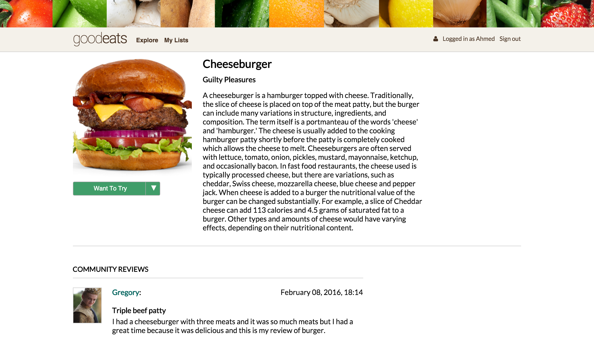

# GoodEats

[Visit]
[Visit]: <http://good-eats.net>

## Description

GoodEats is a web application inspired by GoodReads built using Ruby on Rails
and React.js. GoodEats allows users to:

- [ ] Create an account
- [ ] Log in / Log out
- [ ] Read about edibles
- [ ] Read users' reviews of edibles
- [ ] Create lists to organize your edibles
- [ ] Delete lists
- [ ] Review edibles
- [ ] View their profile

## Instructions

### Authentication

a) Create an account on the sign up page or
b) Login to your account or
c) Login with the guest account

### Browsing

To browse edibles, visit the home page by clicking either the goodeats logo or
Explore link on the site's header. Each edible has a show page with more info
you can access by clicking on it. On the edible's show page you'll see an
image of the edible, a description, and user reviews.

### Adding Edibles

In both the home page and edible's show page you'll see a green  button beneath
each edible's image. Clicking this will add it to the default "Want to Try" list.
You can access a dropdown menu of your lists by hovering over the down arrow to
choose another list or change the list an edible belongs to. If you've added
the edible, the button will display a green check mark and the name of the list.

### Lists

Clicking the My Lists link on the header will show you your lists. The default
lists for each user are "Want to Try" and "Eaten". You can create additional
lists by typing the name into the input field beneath your lists and clicking
Add List. You can delete any of the lists you've created (but not the defaults)
by clicking the X next to its name. This will not delete your review of the
edibles in that list.

### Reviews

To review an edible, go to the list to which you've added it and click Review
to the right of the item. Give it a title and your thoughts and click submit
to publish the review or X out the form to cancel. You should now be able to
see your review on the Edible's show page.

### Profile

Each user has a profile displaying their name, profile picture, account info,
stats, lists, and reviews. You can view it by clicking the user icon on the
right side of the header.
